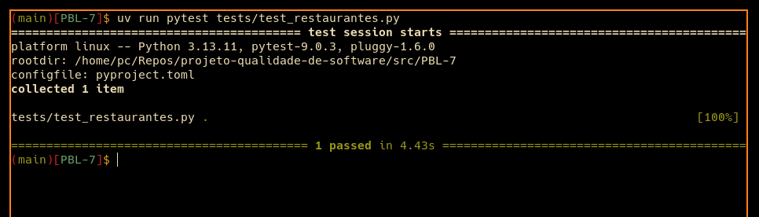

# 🧩 Atividade PBL – Aula 10

## Testes Funcionais Automatizados – LocalEats

---

## 👥 Integrantes

- Marcelo Oscaberry

---

## 🔹 1. Fluxo funcional escolhido

### 🍽️ Fluxo – Navegação e visualização de restaurantes

📌 **Descrição:**  
Permite que o usuário acesse o sistema LocalEats, visualize a lista de restaurantes disponíveis e abra a página de detalhes de um restaurante específico.

🎯 **Importância:**  
Esse fluxo é essencial para a experiência do usuário, pois representa a etapa de exploração antes da escolha de pratos, adição ao carrinho e realização de pedido.

📏 **Cenários esperados:**

- Lista de restaurantes carregada corretamente
- Clique em um restaurante abre a página de detalhes
- URL muda para a tela de restaurante
- Nome do restaurante fica visível na página de detalhes
- Itens do cardápio são exibidos

📌 **Pré-condição do teste:**  
Como o sistema redireciona usuários não autenticados para a tela de login, o teste realiza o cadastro de um usuário temporário antes de validar o fluxo principal de navegação.

---

## 🔹 2. Teste com Codegen

### 💻 Comando utilizado

```bash
playwright codegen https://local-eats-unisenac.vercel.app/
```

### 🧪 Código gerado automaticamente

```python
from playwright.sync_api import Playwright, sync_playwright, expect


def run(playwright: Playwright) -> None:
    browser = playwright.chromium.launch(headless=False)
    context = browser.new_context()
    page = context.new_page()

    page.goto("https://local-eats-unisenac.vercel.app/")
    page.get_by_role("button", name="Criar Conta").click()
    page.get_by_placeholder("Seu nome").fill("Usuario Teste")
    page.get_by_placeholder("novo@teste.com").fill("usuario.teste.local@teste.com")
    page.get_by_placeholder("Min. 3 caracteres").fill("123456")
    page.get_by_role("button", name="Registrar").click()
    page.get_by_role("link", name="Restaurante Sabor 0").click()

    expect(page).to_have_url(
        "https://local-eats-unisenac.vercel.app/static/restaurant.html?id=1"
    )
    expect(page.get_by_text("Cardápio")).to_be_visible()

    context.close()
    browser.close()


with sync_playwright() as playwright:
    run(playwright)
```

### 🧠 Observações iniciais

- ✔ Facilitou a identificação do fluxo real entre login, lista de restaurantes e página de detalhes
- ✔ Ajudou a localizar textos, botões e campos usados pela interface
- ❌ Gerou código muito linear, sem organização por página
- ❌ Não criou funções reutilizáveis
- ❌ Usou seletores frágeis baseados apenas em texto e placeholder
- ❌ Não tratou dados dinâmicos, como e-mail único para cadastro
- ❌ As validações geradas foram insuficientes para garantir que o cardápio carregou

### 📌 O que o Codegen fez bem?

O Codegen registrou rapidamente a sequência de ações do usuário e mostrou quais elementos eram clicáveis na interface. Ele também ajudou a confirmar que a navegação principal passa pela autenticação antes de acessar a lista de restaurantes.

### ⚠️ O que precisou ser melhorado?

O código gerado precisava ser refatorado porque misturava preparação do teste, ações da interface e validações em uma única função. Além disso, os seletores baseados em textos longos poderiam quebrar facilmente se o conteúdo da tela fosse alterado.

---

## 🔹 3. Teste automatizado com Pytest

### 🧪 Arquivo: `src/aula-10-testes-funcionais-automatizados/tests/test_restaurantes.py`

```python
import re
import uuid

from playwright.sync_api import expect, sync_playwright


BASE_URL = "https://local-eats-unisenac.vercel.app/static"


def test_usuario_visualiza_detalhes_de_restaurante():
    email = f"teste-{uuid.uuid4().hex[:8]}@teste.com"

    with sync_playwright() as playwright:
        browser = playwright.chromium.launch(headless=True)
        page = browser.new_page()

        page.goto(f"{BASE_URL}/login.html")
        page.get_by_role("button", name="Criar Conta").click()
        page.locator("#regName").fill("Usuario Teste")
        page.locator("#regEmail").fill(email)
        page.locator("#regPassword").fill("123456")
        page.get_by_role("button", name="Registrar").click()

        expect(page).to_have_url(re.compile(r".*/index\.html"))
        expect(page.locator("#restaurantGrid .rest-card").first).to_be_visible()

        primeiro_restaurante = page.locator("#restaurantGrid .rest-card").first
        primeiro_restaurante.click()

        expect(page).to_have_url(re.compile(r".*/restaurant\.html\?id=\d+"))
        expect(page.locator("#restName")).to_be_visible()
        expect(page.locator("#menuList .menu-item").first).to_be_visible()

        browser.close()
```

### 📌 O que o teste faz?

- Acessa a tela de login
- Cria um usuário temporário para liberar o acesso ao sistema
- Aguarda a lista de restaurantes carregar
- Clica no primeiro restaurante da lista
- Valida a navegação para a página de detalhes
- Verifica se o nome do restaurante aparece
- Verifica se pelo menos um item do cardápio é exibido

### ✅ Assertions relevantes

- URL da página inicial após cadastro
- Existência de pelo menos um card de restaurante
- URL da página de detalhes com `restaurant.html?id=...`
- Visibilidade do nome do restaurante
- Visibilidade de item do cardápio

---

## 🔹 4. Refatoração com Page Object Model (POM)

### 📁 Estrutura refatorada

```text
src/
  aula-10-testes-funcionais-automatizados/
    pyproject.toml
    uv.lock
    pages/
      restaurantes_page.py
    tests/
      test_restaurantes.py
```

### ⚙️ Gerenciamento do ambiente

O ambiente do teste foi configurado com `uv`, evitando instalação manual de dependências com `pip`.

```bash
cd src/aula-10-testes-funcionais-automatizados
uv sync
```

### 🧱 Arquivo: `src/aula-10-testes-funcionais-automatizados/pages/restaurantes_page.py`

```python
import re

from playwright.sync_api import expect


class RestaurantesPage:
    def __init__(self, page):
        self.page = page
        self.base_url = "https://local-eats-unisenac.vercel.app/static"
        self.grid_restaurantes = page.locator("#restaurantGrid")
        self.cards_restaurantes = page.locator("#restaurantGrid .rest-card")
        self.nome_restaurante = page.locator("#restName")
        self.itens_cardapio = page.locator("#menuList .menu-item")

    def cadastrar_usuario_teste(self, nome, email, senha):
        self.page.goto(f"{self.base_url}/login.html")
        self.page.get_by_role("button", name="Criar Conta").click()
        self.page.locator("#regName").fill(nome)
        self.page.locator("#regEmail").fill(email)
        self.page.locator("#regPassword").fill(senha)
        self.page.get_by_role("button", name="Registrar").click()
        expect(self.page).to_have_url(re.compile(r".*/index\.html"))

    def validar_lista_carregada(self):
        expect(self.grid_restaurantes).to_be_visible()
        expect(self.cards_restaurantes.first).to_be_visible()

    def abrir_primeiro_restaurante(self):
        self.cards_restaurantes.first.click()

    def validar_pagina_de_detalhes(self):
        expect(self.page).to_have_url(re.compile(r".*/restaurant\.html\?id=\d+"))
        expect(self.nome_restaurante).to_be_visible()
        expect(self.itens_cardapio.first).to_be_visible()
```

### 🧪 Arquivo: `src/aula-10-testes-funcionais-automatizados/tests/test_restaurantes.py`

```python
import uuid

from playwright.sync_api import sync_playwright

from pages.restaurantes_page import RestaurantesPage


def test_usuario_visualiza_detalhes_de_restaurante():
    email = f"teste-{uuid.uuid4().hex[:8]}@teste.com"

    with sync_playwright() as playwright:
        browser = playwright.chromium.launch(headless=True)
        page = browser.new_page()
        restaurantes = RestaurantesPage(page)

        restaurantes.cadastrar_usuario_teste(
            nome="Usuario Teste",
            email=email,
            senha="123456",
        )
        restaurantes.validar_lista_carregada()
        restaurantes.abrir_primeiro_restaurante()
        restaurantes.validar_pagina_de_detalhes()

        browser.close()
```

### 🧠 Melhorias realizadas

- Separação entre lógica do teste e ações da interface
- Centralização dos seletores na classe `RestaurantesPage`
- Uso de seletores mais estáveis, como `#restaurantGrid`, `.rest-card`, `#restName` e `#menuList`
- Redução de duplicação de código
- Teste principal mais legível e próximo do fluxo real do usuário
- Uso de e-mail dinâmico para evitar falhas por cadastro duplicado
- Validações mais fortes do que apenas verificar mudança de URL

---

## 🔹 5. Execução dos testes

### ▶️ Comando

```bash
cd src/aula-10-testes-funcionais-automatizados
uv sync
uv run playwright install chromium
uv run pytest tests/test_restaurantes.py
```

### 📊 Resultado

- Total de testes: 1
- Testes passaram: 1
- Testes falharam: 0

### 📸 Evidência

Print da execução local do comando:

```bash
cd src/aula-10-testes-funcionais-automatizados
uv run pytest tests/test_restaurantes.py
```



---

## 🔹 6. Análise crítica dos testes

### ❓ O teste quebrou em algum momento? Por quê?

Sim. Durante a gravação inicial, o teste ficou frágil porque dependia de textos gerados na tela e de seletores muito específicos criados pelo Codegen. Também foi necessário considerar que o sistema exige autenticação antes de exibir a lista de restaurantes.

### ❓ Quais seletores foram mais difíceis?

Os cards de restaurantes foram os elementos mais sensíveis, porque são renderizados dinamicamente por JavaScript após chamada à API. Por isso, foi melhor validar primeiro o container `#restaurantGrid` e depois acessar `.rest-card`.

### ❓ O Codegen ajudou ou gerou problemas?

O Codegen ajudou no início, pois mostrou o fluxo real de navegação e os elementos principais. Porém, o código bruto não era adequado para entrega final, porque ficou verboso, pouco reutilizável e com seletores frágeis.

### ❓ O teste é confiável? Por quê?

O teste é razoavelmente confiável porque valida elementos reais da tela, aguarda a lista carregada e usa seletores estruturais do HTML. Mesmo assim, ainda depende da disponibilidade do ambiente publicado e da API de restaurantes.

### ❓ O que tornaria o teste mais robusto?

- Adicionar atributos `data-testid` nos principais elementos da interface
- Separar autenticação em um fixture reutilizável
- Criar massa de dados controlada para restaurantes
- Evitar dependência do primeiro item da lista
- Executar os testes em ambiente de homologação estável

### ❓ Quais são os riscos de manutenção?

- Mudança na estrutura HTML dos cards
- Alteração nos IDs usados pela interface
- Instabilidade da API publicada
- Mudança no fluxo de autenticação
- Alteração no nome das rotas `index.html` e `restaurant.html`

---

## 🔹 7. Reflexão no contexto do LocalEats

### ❓ Testes automatizados substituem testes manuais?

Não. Testes automatizados reduzem retrabalho em fluxos repetitivos e ajudam a identificar regressões, mas testes manuais continuam importantes para avaliar usabilidade, comportamento visual e situações exploratórias.

### ❓ Vale a pena automatizar todos os fluxos?

Não necessariamente. Automatizar todos os fluxos pode gerar alto custo de manutenção. O ideal é priorizar fluxos críticos, repetitivos e de maior impacto para o usuário ou para o negócio.

### ❓ Qual tipo de teste deve ser priorizado?

Devem ser priorizados testes E2E dos fluxos principais, como login, navegação por restaurantes, visualização de detalhes, carrinho e checkout. Também é importante manter testes unitários para regras de negócio, porque eles são mais rápidos e baratos de manter.

### ❓ Como isso ajuda no projeto do grupo?

A automação aumenta a confiança para alterar o frontend e publicar novas versões do LocalEats. Com testes funcionais, é possível perceber rapidamente se uma mudança quebrou a navegação principal do usuário.

---

## 💡 Conclusão

A automação de testes funcionais com Playwright e Pytest melhora a confiabilidade do LocalEats ao validar o sistema pelo ponto de vista do usuário. O Codegen é útil como ponto de partida, mas não deve ser entregue sem refatoração. A organização com Page Object Model deixa o teste mais claro, reduz duplicação e facilita manutenção quando a interface muda.
