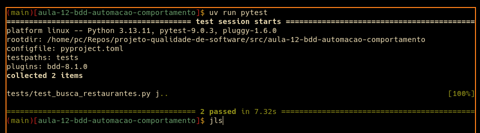

## 👥 Integrantes

- Marcelo Oscaberry

---

## 🔹 1. Fluxo escolhido

### 🔎 Busca de restaurantes

📌 **Descrição:**  
Permite pesquisar restaurantes disponíveis no LocalEats a partir de um termo informado pelo usuário.

❗ **Problema que resolve:**  
Facilita a descoberta de restaurantes e reduz o esforço para encontrar opções específicas dentro da lista.

🎯 **Importância:**  
É um fluxo central de descoberta do sistema. Antes de visualizar detalhes, adicionar itens ao carrinho ou fazer um pedido, o usuário precisa encontrar restaurantes relevantes.

📏 **Cenários esperados:**

- Busca válida retorna restaurantes compatíveis
- Busca inexistente informa que nenhum restaurante foi encontrado
- A listagem inicial permanece disponível quando o usuário entra na página de exploração

---

## 🔹 2. Escrita dos cenários BDD

### 📁 Arquivo: `src/aula-12-bdd-automacao-comportamento/features/busca_restaurantes.feature`

```gherkin
Feature: Busca de restaurantes

  Scenario: Buscar restaurantes por localizacao existente
    Given que o usuario autenticado esta na pagina de exploracao
    When pesquisar por "Centro"
    Then o sistema deve exibir restaurantes encontrados

  Scenario: Buscar restaurantes por termo inexistente
    Given que o usuario autenticado esta na pagina de exploracao
    When pesquisar por "XYZ123"
    Then o sistema deve informar que nenhum restaurante foi encontrado
```

### 🧠 Justificativa dos cenários

Os cenários foram escritos pensando no comportamento esperado do sistema, não apenas nos cliques da interface. Uma pessoa não técnica consegue entender que a busca deve retornar resultados quando o termo existe e deve informar vazio quando o termo não existe.

---

## 🔹 3. Implementação da automação com pytest-bdd

### 📁 Estrutura do projeto

```text
src/
  aula-12-bdd-automacao-comportamento/
    pyproject.toml
    uv.lock
    features/
      busca_restaurantes.feature
    tests/
      test_busca_restaurantes.py
```

### ⚙️ Gerenciamento do ambiente

O ambiente foi configurado com `uv`, mantendo as dependências do PBL isoladas.

```bash
cd src/aula-12-bdd-automacao-comportamento
uv sync
uv run playwright install chromium
```

### 🧪 Arquivo: `src/aula-12-bdd-automacao-comportamento/tests/test_busca_restaurantes.py`

```python
import re
import uuid
from pathlib import Path

import pytest
from playwright.sync_api import expect, sync_playwright
from pytest_bdd import given, parsers, scenarios, then, when


BASE_URL = "https://local-eats-unisenac.vercel.app/static"
FEATURES_DIR = Path(__file__).parent.parent / "features"

scenarios(str(FEATURES_DIR / "busca_restaurantes.feature"))


@pytest.fixture
def page():
    with sync_playwright() as playwright:
        browser = playwright.chromium.launch(headless=True)
        page = browser.new_page()
        yield page
        browser.close()


@given("que o usuario autenticado esta na pagina de exploracao")
def usuario_autenticado_na_exploracao(page):
    email = f"bdd-{uuid.uuid4().hex[:8]}@teste.com"

    page.goto(f"{BASE_URL}/login.html")
    page.get_by_role("button", name="Criar Conta").click()
    page.locator("#regName").fill("Usuario BDD")
    page.locator("#regEmail").fill(email)
    page.locator("#regPassword").fill("123456")
    page.get_by_role("button", name="Registrar").click()

    expect(page).to_have_url(re.compile(r".*/index\.html"))
    expect(page.locator("#restaurantGrid .rest-card").first).to_be_visible()


@when(parsers.parse('pesquisar por "{termo}"'))
def pesquisar_por_termo(page, termo):
    page.locator("#searchInput").fill(termo)
    page.locator("#searchBtn").click()


@then("o sistema deve exibir restaurantes encontrados")
def validar_resultados_encontrados(page):
    grid = page.locator("#restaurantGrid")
    primeiro_card = grid.locator(".rest-card").first

    expect(primeiro_card).to_be_visible()
    expect(grid).to_contain_text("Centro")


@then("o sistema deve informar que nenhum restaurante foi encontrado")
def validar_resultado_vazio(page):
    expect(page.locator("#restaurantGrid")).to_contain_text(
        "Nenhum restaurante encontrado."
    )
```

### ✅ Assertions relevantes

- Valida que o usuário autenticado chega à página `index.html`
- Valida que a lista inicial de restaurantes carregou
- Valida que uma busca por `"Centro"` exibe cards encontrados
- Valida que uma busca por `"XYZ123"` exibe mensagem de lista vazia

---

## 🔹 4. Organização do projeto

A automação foi organizada separando comportamento e implementação:

- `features/` contém os cenários em Gherkin
- `tests/` contém os steps do `pytest-bdd`
- `pyproject.toml` declara dependências e configuração do Pytest
- `uv.lock` mantém o ambiente reproduzível
- `artefatos/evidencias/` concentra as evidências de execução

Essa organização facilita manutenção porque alterações no comportamento esperado ficam no arquivo `.feature`, enquanto detalhes de automação permanecem no teste Python.

---

## 🔹 5. Execução dos testes

### ▶️ Comando

```bash
cd src/aula-12-bdd-automacao-comportamento
uv sync
uv run playwright install chromium
uv run pytest
```

### 📊 Resultado

- Total de cenários: 2
- Cenários passaram: 2
- Cenários falharam: 0

### 📸 Evidência

Print da execução local do comando:

```bash
cd src/aula-12-bdd-automacao-comportamento
uv run pytest
```



---

## 🔹 6. Análise crítica

### ❓ O cenário escrito ficou compreensível?

Sim. A estrutura Given-When-Then deixou claro o comportamento esperado: o usuário acessa a página de exploração, realiza uma busca e o sistema apresenta o resultado correspondente.

### ❓ O teste automatizado ficou legível?

Sim. O arquivo `.feature` descreve o comportamento em linguagem próxima ao negócio, enquanto o teste Python concentra os detalhes técnicos de Playwright, autenticação e assertions.

### ❓ O BDD ajudou a entender o comportamento?

Sim. O BDD tornou o objetivo do teste mais claro do que um teste puramente técnico, porque o cenário descreve a regra esperada antes da implementação dos cliques.

### ❓ Quais dificuldades surgiram?

A principal dificuldade foi lidar com a autenticação obrigatória antes da busca. Para manter o teste independente, foi criado um usuário temporário em cada cenário.

### ❓ Os seletores foram frágeis?

Os seletores ficaram razoavelmente estáveis porque usam IDs e classes estruturais da aplicação, como `#searchInput`, `#searchBtn` e `#restaurantGrid`. Ainda assim, seriam mais robustos com atributos `data-testid`.

### ❓ O teste ficou dependente da interface?

Sim. Como o teste usa Playwright e valida a aplicação pela interface, mudanças no HTML, nos IDs ou na mensagem de vazio podem quebrar a automação.

### ❓ O cenário representa realmente uma regra de negócio?

Sim. A busca de restaurantes é um comportamento esperado do sistema e impacta diretamente a capacidade do usuário de encontrar opções para realizar pedidos.

### ❓ O que tornaria o teste mais robusto?

- Adicionar `data-testid` nos campos, botões e mensagens principais
- Criar massa de dados controlada para restaurantes
- Evitar depender de textos que podem mudar por decisão visual
- Separar autenticação em fixture reutilizável
- Executar os testes em ambiente de homologação estável

---

## 🔹 7. Reflexão no contexto do LocalEats

### ❓ BDD melhora comunicação entre equipe?

Sim. O BDD aproxima negócio, qualidade e desenvolvimento porque descreve o comportamento em uma linguagem compreensível por todos.

### ❓ Todo teste deve ser escrito em BDD?

Não. BDD é mais indicado para fluxos importantes, regras de negócio e comportamentos que precisam ser discutidos entre áreas. Testes unitários simples não precisam necessariamente de Gherkin.

### ❓ Quando vale a pena usar BDD?

Vale a pena quando o comportamento precisa ser documentado de forma clara, validado automaticamente e entendido por pessoas técnicas e não técnicas.

### ❓ O comportamento ficou mais claro?

Sim. O comportamento da busca ficou explícito nos cenários: uma busca existente deve retornar resultados e uma busca inexistente deve informar que nada foi encontrado.

### ❓ Como isso ajuda no projeto do grupo?

Ajuda a transformar requisitos em documentação viva. Se a busca quebrar em uma mudança futura, o cenário BDD falha e mostra qual comportamento deixou de ser atendido.

---

## 💡 Conclusão

A aplicação de BDD no LocalEats permitiu transformar o comportamento de busca em cenários claros, legíveis e automatizados. A integração entre `pytest-bdd` e Playwright aproximou a descrição do requisito da validação real na interface, criando uma documentação executável mais útil para manutenção e evolução do sistema.
