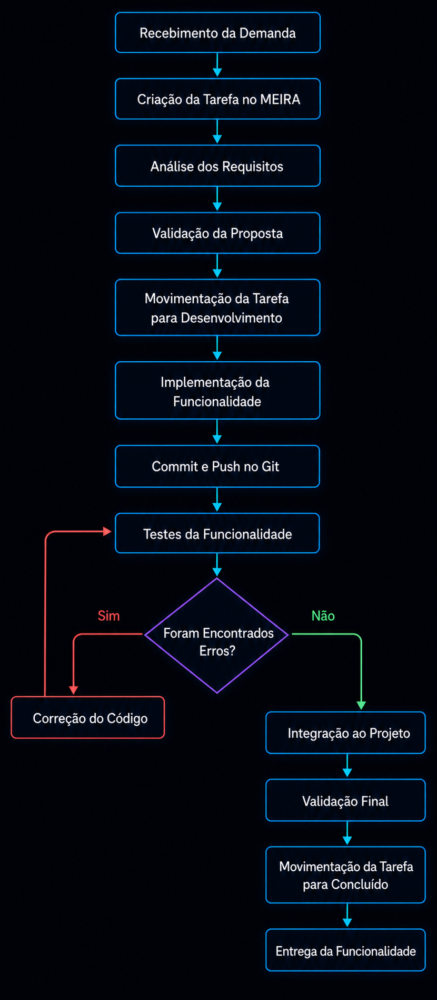

# Aula 14 – Qualidade de Processo

## Introdução

Este documento descreve o processo de desenvolvimento adotado no projeto **LocalEats**. A proposta é mapear as etapas de trabalho, relacionando entradas, atividades e saídas, e mostrar em quais momentos a qualidade é considerada antes da entrega.

O fluxo utiliza o **MEIRA** como ferramenta de organização do trabalho. O MEIRA é um sistema de gerenciamento de projetos desenvolvido como TCC, com recursos como Kanban, Traceboard, sprints, chat e colaboração em tempo real. Neste processo, ele substitui ferramentas como Trello para acompanhar tarefas, enquanto **Git** e testes apoiam versionamento e validação.

- Site do MEIRA: <https://meira.marce1in.com.br/>
- Repositório do MEIRA: <https://gitlab.com/senac-projetos-de-desenvolvimento/2025-marcelo-oscaberry-dos-santos/meira>

---

# 1. Mapeamento do Processo

---

# 2. Identificação de Entradas, Atividades e Saídas

| Etapa | Entrada | Atividade | Saída |
| --- | --- | --- | --- |
| Recebimento da Demanda | Necessidade de funcionalidade ou correção | Registrar a solicitação e entender o objetivo | Demanda identificada |
| Criação da Tarefa | Demanda descrita | Criar tarefa no MEIRA e posicionar no Kanban | Tarefa criada |
| Análise dos Requisitos | Tarefa aberta | Definir escopo, regra de negócio e critérios de aceite | Requisitos compreendidos |
| Desenvolvimento | Tarefa priorizada | Implementar a funcionalidade no código | Código desenvolvido |
| Controle de Versão | Código finalizado localmente | Fazer commit e push no Git | Alteração versionada |
| Testes | Código versionado | Executar testes automatizados e validações manuais | Resultado dos testes |
| Correção | Falhas encontradas | Corrigir defeitos e repetir a validação | Código corrigido |
| Integração | Testes aprovados | Integrar ao projeto e atualizar o Kanban | Funcionalidade pronta |
| Entrega | Funcionalidade validada | Concluir a tarefa e registrar evidências | Entrega realizada |

---

# 3. Reflexão sobre o Processo

## O processo utilizado pela equipe está claramente definido?

Sim. O processo segue um fluxo simples e visível no MEIRA, com etapas para análise, desenvolvimento, testes, correção e entrega. A organização por tarefas ajuda a manter histórico e responsabilidade sobre cada demanda.

## Todos os integrantes seguem o mesmo fluxo de trabalho?

Como a atividade está sendo conduzida individualmente, o fluxo foi padronizado para manter consistência entre as aulas. Em um time maior, o mesmo processo poderia ser aplicado por todos os integrantes usando o mesmo quadro Kanban.

## Em quais etapas a qualidade é verificada?

A qualidade aparece na análise dos requisitos, na validação da proposta, nos testes automatizados e na revisão do resultado antes de concluir a tarefa. Quando um erro é encontrado, a demanda retorna para correção e passa novamente pelos testes.

## Quais melhorias poderiam tornar o processo mais eficiente?

O processo poderia evoluir com critérios de aceite mais detalhados em todas as tarefas, revisão de código antes da conclusão e métricas de qualidade acompanhadas no próprio MEIRA.

## Como a qualidade do processo impacta a qualidade do produto final?

Um processo organizado reduz retrabalho, torna defeitos mais visíveis e evita que funcionalidades sejam entregues sem validação. Isso melhora a estabilidade do produto e aumenta a confiança no resultado final.

---

# Conclusão

A análise mostra que a qualidade do processo está ligada à clareza das etapas e à capacidade de acompanhar cada demanda. O uso do MEIRA como ferramenta de organização, combinado com Git e testes, contribui para um fluxo mais rastreável e facilita identificar problemas antes da entrega.
