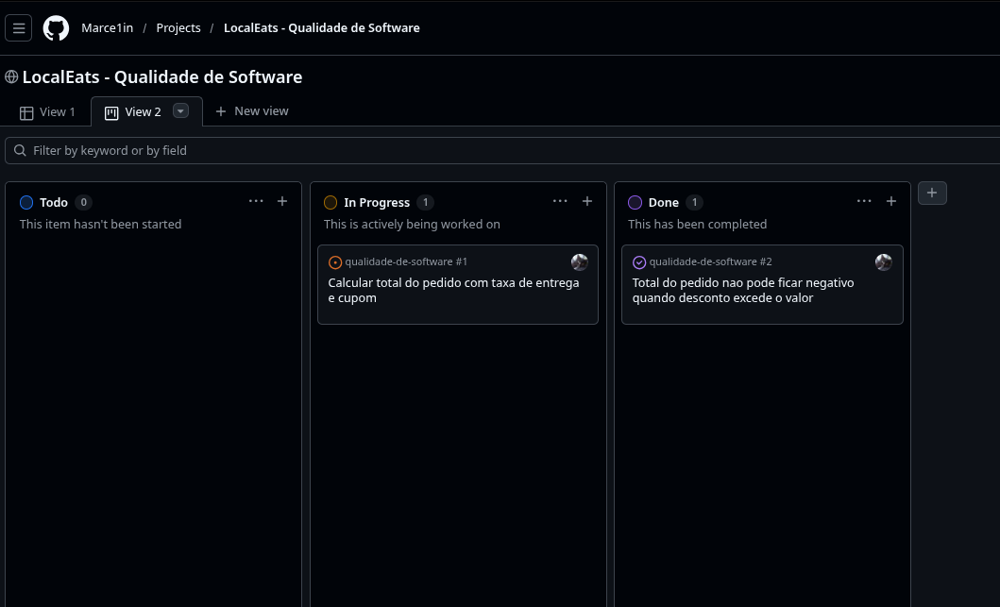
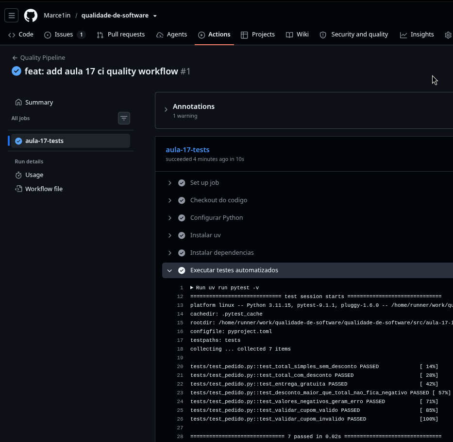

# Aula 17 – Integração Contínua, Qualidade Automatizada, Métricas e Gestão de Defeitos – LocalEats

**Disciplina:** Qualidade de Software

**Professor:** Luciano Zanuz

**Curso:** ADS - Análise e Desenvolvimento de Sistemas / SPI - Sistemas para Internet

**Sistema referência:** [LocalEats](https://local-eats-unisenac.vercel.app/)

## 👥 Integrantes

- Marcelo Oscaberry | Funcionalidade, testes automatizados, pipeline de CI e quadro Kanban

---

## 🔹 1. Repositório da Atividade

| Item | Descrição |
| --- | --- |
| Nome do repositório | `qualidade-de-software` |
| Link do repositório | https://github.com/Marce1in/qualidade-de-software |
| Link do Quadro KanBan (GitHub Projects) | https://github.com/users/Marce1in/projects/3/views/1?layout=board |

### Evidência do quadro Kanban



### Estrutura de diretórios utilizada

```text
src/aula-17-integracao-continua-qualidade/
├── localeats_ci/
│   ├── __init__.py
│   └── pedido.py
├── tests/
│   └── test_pedido.py
├── pyproject.toml
└── uv.lock

.github/
└── workflows/
    └── quality.yml
```

---

## 🔹 2. Planejamento da Funcionalidade

| Item | Descrição |
| --- | --- |
| Título da Issue | `Calcular total do pedido com taxa de entrega e cupom` |
| Objetivo da funcionalidade | Calcular o valor final de um pedido do LocalEats, somando subtotal e entrega, aplicando cupom de desconto e evitando resultado negativo. |
| Link da Issue | https://github.com/Marce1in/qualidade-de-software/issues/1 |

---

## 🔹 3. Teste Automatizado

| Item | Descrição |
| --- | --- |
| Tipo de teste | Unitário com pytest |
| Objetivo do teste | Validar cálculo do total do pedido, comportamento com entrega grátis, desconto maior que o total e validação de cupons. |
| Link para o arquivo do teste | https://github.com/Marce1in/qualidade-de-software/blob/main/src/aula-17-integracao-continua-qualidade/tests/test_pedido.py |

### Código da funcionalidade (`pedido.py`)

```python
def calcular_total_pedido(subtotal: float, taxa_entrega: float = 0.0, desconto: float = 0.0) -> float:
    if subtotal < 0 or taxa_entrega < 0 or desconto < 0:
        raise ValueError("Valores do pedido nao podem ser negativos.")

    total = subtotal + taxa_entrega - desconto
    return max(round(total, 2), 0.0)


def validar_cupom(codigo: str | None, cupons_validos: dict[str, float]) -> float:
    if not codigo:
        return 0.0

    codigo_normalizado = codigo.strip().upper()
    if not codigo_normalizado:
        return 0.0

    return cupons_validos.get(codigo_normalizado, 0.0)
```

### Código do teste (`tests/test_pedido.py`)

```python
def test_total_com_desconto():
    resultado = calcular_total_pedido(
        subtotal=50.0,
        taxa_entrega=5.0,
        desconto=10.0,
    )

    assert resultado == 45.0


def test_desconto_maior_que_total_nao_fica_negativo():
    resultado = calcular_total_pedido(
        subtotal=20.0,
        taxa_entrega=5.0,
        desconto=100.0,
    )

    assert resultado == 0.0
```

O arquivo completo contém 7 testes, cobrindo cenários de sucesso e borda.

### Gerenciamento do ambiente

O ambiente foi configurado com `uv`, seguindo o padrão dos demais módulos em `src/aula-*`.

```bash
cd src/aula-17-integracao-continua-qualidade
uv sync
uv run pytest -v
```

---

## 🔹 4. Pipeline de Integração Contínua

| Item | Descrição |
| --- | --- |
| Nome do workflow | `Quality Pipeline` |
| Evento que dispara a execução | `push` e `pull_request` na branch `main` |
| Link para o arquivo do workflow | https://github.com/Marce1in/qualidade-de-software/blob/main/.github/workflows/quality.yml |
| Link de uma execução do workflow | https://github.com/Marce1in/qualidade-de-software/actions/runs/28716744717 |

### Código do workflow (`.github/workflows/quality.yml`)

```yaml
name: Quality Pipeline

on:
  push:
    branches: ["main"]
  pull_request:
    branches: ["main"]

jobs:
  aula-17-tests:
    runs-on: ubuntu-latest
    defaults:
      run:
        working-directory: src/aula-17-integracao-continua-qualidade

    steps:
      - name: Checkout do codigo
        uses: actions/checkout@v4

      - name: Configurar Python
        uses: actions/setup-python@v5
        with:
          python-version: "3.11"

      - name: Instalar uv
        uses: astral-sh/setup-uv@v6

      - name: Instalar dependencias
        run: uv sync --locked

      - name: Executar testes automatizados
        run: uv run pytest -v
```

---

## 🔹 5. Indicadores de Qualidade

| Indicador | Valor |
| --- | --- |
| Quantidade de testes executados | 7 |
| Quantidade de testes aprovados | 7 |
| Quantidade de testes com falha | 0 |
| Status final do pipeline | Aprovado no GitHub Actions |

---

## Evidência da Execução

A execução local foi validada com `uv run pytest -v` e o mesmo conjunto de testes foi executado pelo workflow `Quality Pipeline` no GitHub Actions.



---

## 🔹 6. Registro de Defeito

| Item | Descrição |
| --- | --- |
| Título do defeito | `Total do pedido nao pode ficar negativo quando desconto excede o valor` |
| Severidade | Média |
| Link da Issue | https://github.com/Marce1in/qualidade-de-software/issues/2 |

**Qual foi o defeito?**

O problema ocorre quando o desconto aplicado é maior que a soma do subtotal com a taxa de entrega. Sem tratamento, o pedido poderia terminar com valor final negativo.

**Como ele foi identificado?**

O cenário foi coberto pelo teste `test_desconto_maior_que_total_nao_fica_negativo`, que valida a regra de negócio antes da entrega.

**Como foi corrigido?**

A função passou a retornar `max(total, 0.0)`, garantindo que o resultado mínimo seja zero mesmo quando o desconto exceder o valor do pedido.

---

## 💡 Reflexão final

A integração contínua ajuda a manter a qualidade porque executa os testes sempre que há alteração no repositório. No contexto do LocalEats, isso reduz o risco de uma mudança quebrar regras importantes, como cálculo de total, validação de cupom e tratamento de valores inválidos.
